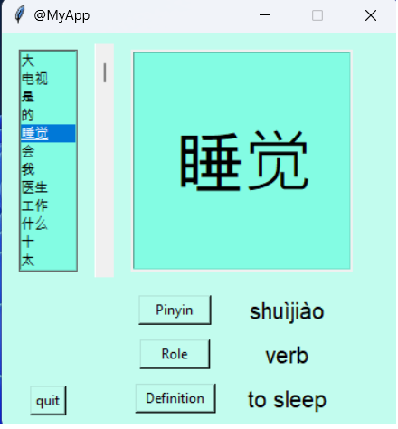

<!--Please do not remove this part-->


# Chinese Flashcards


*Designed by Freepik*

<!--An image is an illustration for your project, the tip here is using your sense of humour as much as you can :D 

You can copy paste my markdown photo insert as following:
<p align="center">

-->

## 🛠️ Description
<!--Remove the below lines and add yours -->
A tkinter application which displays chinese characters.

+ click on the characters from the list.
+ click on one or more button (pinyin, role, definition)

The characters come from the HSK1 list (non official).

More informations on [pinyin](https://en.wikipedia.org/wiki/Pinyin).

More informations on [HSK](https://en.wikipedia.org/wiki/Hanyu_Shuiping_Kaoshi).

## ⚙️ Languages or Frameworks Used
<!--Remove the below lines and add yours -->
+ beautifulsoup4==4.11.1
+ requests==2.28.1
+ python 3.10.6

## 🌟 How to run
<!--Remove the below lines and add yours -->
Move to the app folder.
```sh
cd app
```
Run the main file.
```sh
python main.py
```

## 📺 Demo



## 🤖 Author
<!--Remove the below lines and add yours -->
[CMagnac](https://github.com/CMagnac)