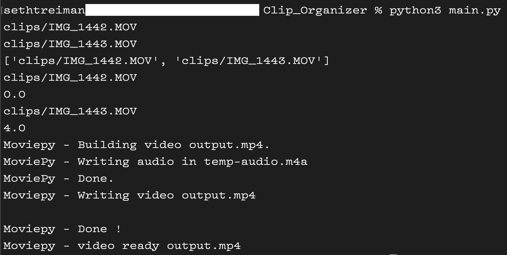

<!--Please do not remove this part-->

# Clip Organizer

<!--An image is an illustration for your project, the tip here is using your sense of humour as much as you can :D 

You can copy paste my markdown photo insert as following:

-->

## 🛠️ Description
<!--Remove the below lines and add yours -->
This script takes in a directory of video clips, and outputs one video clip featuring all of the input clips. However, it plays them back in real time. For example, if you filmed a one minute clip from 5:01am to 5:02am, and another one minute clip from 5:05am to 5:06am, the output clip would be 5 minutes in length. The first minute of the output clip would be the first input clip (the 5:01am clip), then there would be 3 minutes of just a black screen. Finally, the last minute of hte output clip would be the second input clip (the 5:05am clip). This is useful for syncing up b-roll and organizing clips. 

## ⚙️ Languages or Frameworks Used
<!--Remove the below lines and add yours -->
At a minimum, you need to install MoviePy with pip/pip3. You may also need to install some audio codecs, but that varies greatly from machine to machine. It shouldn't be too difficult ot debug.

## 🌟 How to run
<!--Remove the below lines and add yours -->
1. Copy all of the clips you want to use into the clips folder. 
2. Run the script. 
3. Done!

Note- make sure you don't have a .DS_store file in the clips directory. This can cause issues.

## 📺 Demo

## 🤖 Author
<!--Remove the below lines and add yours -->
Seth Treiman
