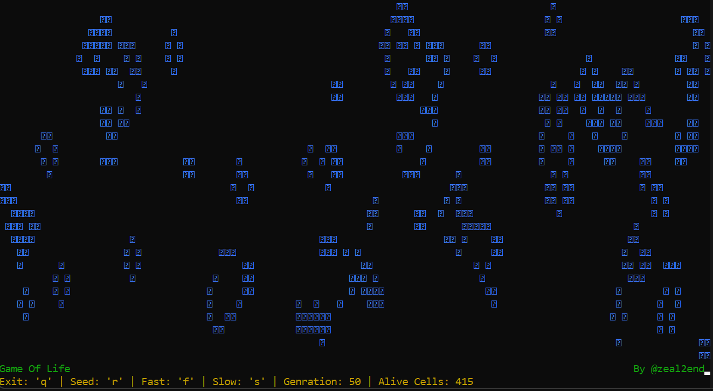

<!--Please do not remove this part-->


[](https://github.com/zeal2end)

# Script Title

<!--An image is an illustration for your project, the tip here is using your sense of humour as much as you can :D 

<!-- You can copy paste my markdown photo insert as following: -->
<p align="center">


## 🛠️ Description
<!--Remove the below lines and add yours -->
A simple Command line UI project for Visualizing Convoy's Game Of Life developed using python and curses(its a python library for cmd line UI). If you haven't heard about Convoy's Game of Life, definately checkout this [video](https://www.youtube.com/watch?v=6avJHaC3C2U) on youtube by Dylan Beattie. Thanks me later!!

## ⚙️ Languages or Frameworks Used
<!--Remove the below lines and add yours -->
If you are on linux, you are good to go just head toward your terminal.

On Windows,
```sh
pip install curses
```

## 🌟 How to run
<!--Remove the below lines and add yours -->
Running the Script is really simple just head over to the directory of the code into your terminal and run this line:
```sh
python GameOfLife.py
```

## 📺 Demo
<p align="center">


## 🤖 Author
<!--Remove the below lines and add yours -->
[Vivek Kumar](https://github.com/zeal2end)