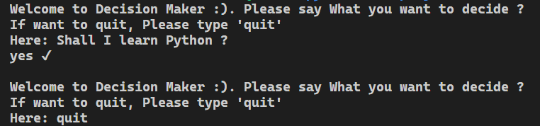

<!--Please do not remove this part-->


# Decision Maker


## 🛠️ Description

You may struct in some situation and you need some guidance. Here is Decision Maker.
These decisions are totaly random. So you don't have to worry about anything about privacy

## ⚙️ Languages or Frameworks Used

```
pip install random
```

## 🌟 How to run

If you are on windows, run by

```
python main.py
```

If you are on Linux or Mac, Run by

```
python3 main.py
```

## 📺 Demo



## 🤖 Author

- [Codechickdev](https://github.com/codechickdev)
