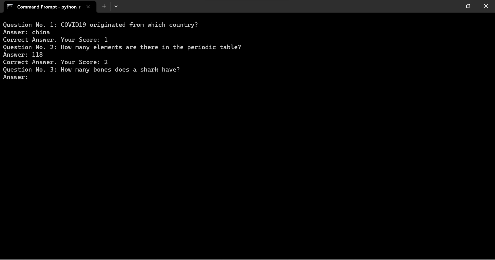

[](https://github.com/arifaisal123)

# GK Maestro
## 🛠️ Description
Simple quiz app that generates 10 General Knowledge questions for the user to answer.

### ⚙️ Prerequisites
Python is required to run the script. Art and Random modules are used for this project.

### 🌟 How to run 
Running the script is really simple! Just open a terminal in the folder where your script is located and run the following command:

```
python main.py
```

### 📺 Demo


## 🤖 Author
[Arif Faisal](https://arifaisal123.github.io)
🔗 [GitHub](https://github.com/arifaisal123)
🔗 [Linkfree](https://linkfree.io/arifaisal123)
