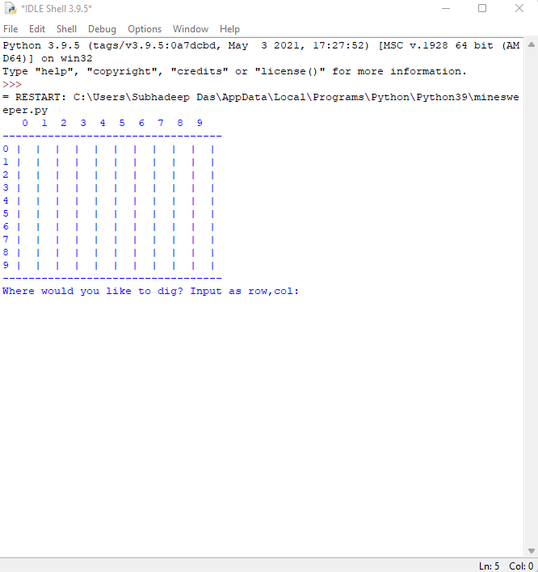
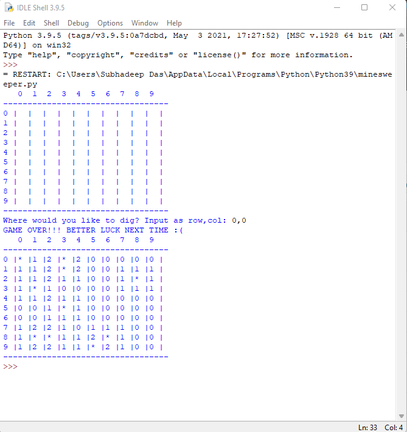

# Minesweeper Game
The classic Minesweeper game in python. 

## Library used
`import random` and `import re`

## How to run the script
`python minesweeper.py`

## Screenshot

## *Author Name*
[`Subhadeep Das(Raven1233)`](https://github.com/Raven1233)