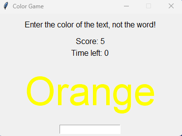

<!--Please do not remove this part-->

# Script Title

## 🛠️ Description

This open-source project contains mini python projects which you can create as a beginner. If you want, you can get the python files and edit them as you want. Feel free to contribute to this repository. You can,
    1. Improve functionaly
    2. Fix a bug
    3. Or add a new cool feature

Try to contribute as much as you can. Even a small contribution is enough.

## ⚙️ Languages or Frameworks Used

You can see the modules required to be able to use the following scripts in the `requirement.txt` file and also you can see how to install them so that you can run the scripts successfully. Run the command given in the file on your terminal.

## 🌟 How to run

You can type this command on your teminal to run the scripts.
`python <the path of the python file>`

if this doesn't work try,
`python3 <the path of the python file>`

To stop it you can press CTRL + C

## 📺 Demo

Some demos of the scripts.

## 🤖 Author

This script is by ndleah.

Dulneth Fernando -> https://github.com/DulnethFernando
This is my github profile.