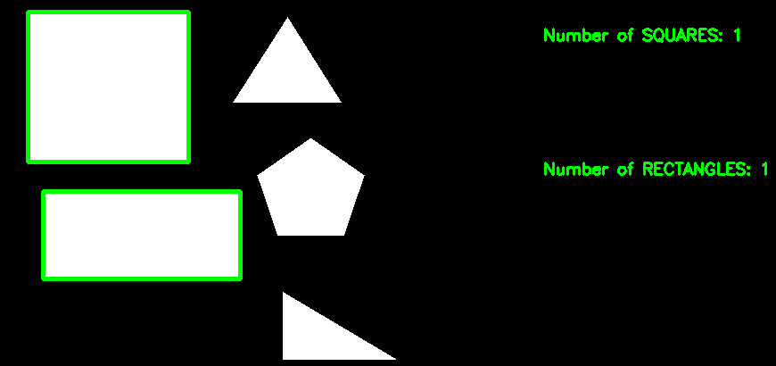

# Shape Recognition using OpenCV


## 🛠️ Description
This is a shape recognition program that detects and outlines the rectangle and square shapes.

## ⚙️ Languages or Frameworks Used
<!--Remove the below lines and add yours -->
Open Command Prompt and use the following command to install the required modules:

```sh 
pip install opencv-python
```


## 🌟 How to run
Place and rename your image as 'shape.jpg' within the Shape_Recognition folder. After doing that, you can
just open a terminal in the folder where your script is located and run the following command:


Feel free to remove the pre-existing shape.jpg to your wishes and replace it with yours :)
```sh
python main.py
```

## 📺 Demo



## 🤖 Author
[Osmiuth](https://github.com/Osmiuth)

## References

https://opencv24-python-tutorials.readthedocs.io/_/downloads/en/stable/pdf/

## Acknowledgement

Special thanks to [AnishLohiya](https://github.com/AnishLohiya) for his work on Face Recognition as inspiration to make this simple program.