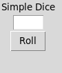

[](https://github.com/tusuii)
[](https://github.com/tusuii?tab=repositories)

# Simple Dice
<p align="center">


This is a simple dice rolling application written in Python using the Tkinter library.

## How to use

1. Clone the repository/copy code to your local machine.
2. Open a terminal window and navigate to the project directory.
3. Run the following command to start the application:

```python
python dice.py
```

4. The application will open a window with a label and an entry box.

5. Enter a number in the entry box and click the "Roll" button.

6. The application will roll a die and display the result in the entry box.

* Features

-[X] The application can roll a die from 1 to 6.

-[X] The application has a simple user interface.

-[X] The application is easy to use.

