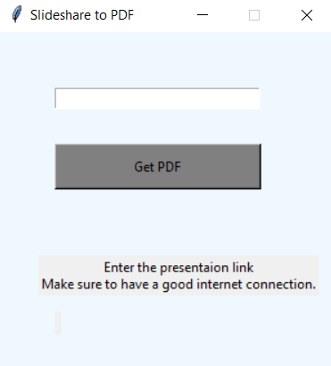
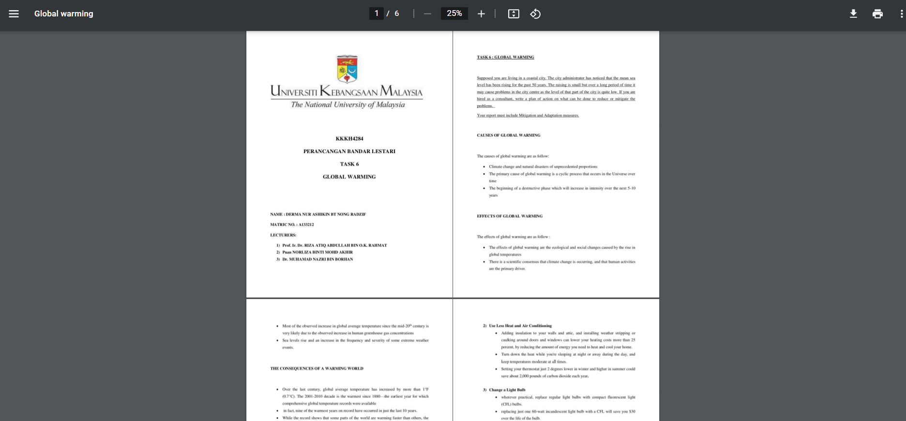

<!--Please do not remove this part-->

# Slideshare to PDF
### Main Window:

 

### Downloaded file:

## 🛠️ Description
To download a presentation from slideshare we have to sign up to scribd, but with this script you can download 
any presentation from the slideshare without any signup, provided that you have a good internet connection. The script uses PIL, requests, 
beautifulsoup, modules to scrape the images from the presentation and then convert it to a pdf file.
The success rate of the script depends on the speed of your internet connection, so for the best results 
try connecting to a good network.

## ⚙️ Language Used
Made with `python`

`tkinter` module for the GUI

`bs4` module for scraping.

`PIL` module for images.

## 🌟 How to run
- Clone the Project
- Run `pip install requirements.txt`
- Run `python main.py`

## 🤖 Author
[Vivek](https://github.com/vivekthedev)

Any Questions?
[Twitter](https://twitter.com/vivekthedev)
