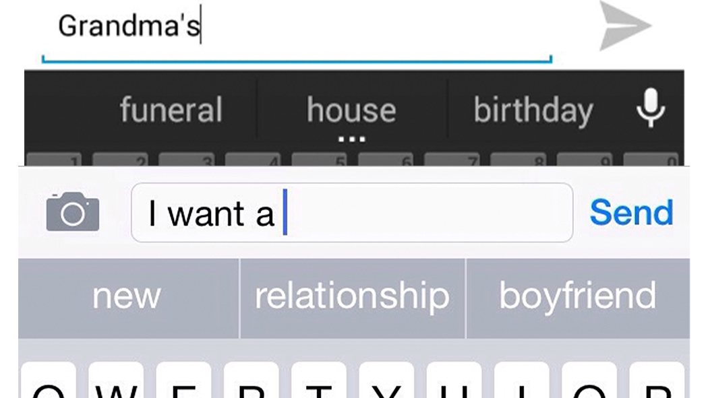

# Text prediction using N-gram Language Model

<p align="center">



## ⚙️ Languages or Frameworks Used
This Python project utilizes the Natural Language Toolkit (NLTK) library to implement an N-gram language model. The code
includes the following packages:
### Packages

1. **Pandas:** A data manipulation library used for handling and analyzing tabular data.

2. **NLTK (Natural Language Toolkit):**
    - `bigrams`: Module for extracting bigrams from a sequence of words.
    - `lm.preprocessing.pad_both_ends`: Preprocessing module for padding both ends of a sequence.
    - `tokenize.WordPunctTokenizer`: Tokenizer for breaking text into words using punctuation and whitespace.

    - `lm.Vocabulary`: Module for constructing a vocabulary from a given text corpus.
    - `lm.Laplace`: Module implementing Laplace smoothing for language modeling.

## 🛠️ Description

### N-gram Language Model Project
This Python project implements a text prediction system using the Laplace smoothing model with bigrams. The goal is to predict the next word in a given sentence based on the provided prefix. The project utilizes the Natural Language Toolkit (NLTK) library for processing and modeling natural language data.

### How It Works

1. **Data Preprocessing:**
   - The project starts by reading a CSV file (`train.csv`) containing text data.
   - HTML tags are removed from the 'Body' column of the dataset using a function called `remove_html_tags`.
   - The text is tokenized using the `WordPunctTokenizer` from NLTK.

2. **N-gram Model Building:**
   - The corpus is then processed further by padding both ends of each sentence with special symbols ("<s>" and "</s>") using the `pad_both_ends` function.
   - Bigrams are extracted from the padded sentences using the `bigrams` function.
   - The vocabulary is constructed using the `Vocabulary` class from NLTK.

3. **Laplace Smoothing Model:**
   - The Laplace smoothing model is implemented using the `Laplace` class from NLTK's language modeling module.
   - The model is trained on the bigram data.

4. **Next-word Prediction:**
   - User input is taken to provide a prefix for next-word prediction.
   - The Laplace model scores each word in the vocabulary based on its likelihood to follow the given prefix.
   - The top three predictions with their respective scores are displayed.


## 🌟 How to run

1. **Instal** the required dependencies:

```bash
pip install -r requirements.txt
```

2. **Run** the code:

```bash
python text_prediction.py
```

## 📺 Demo


## 🤖 Author

links : [louisbau](https://github.com/louisbau)