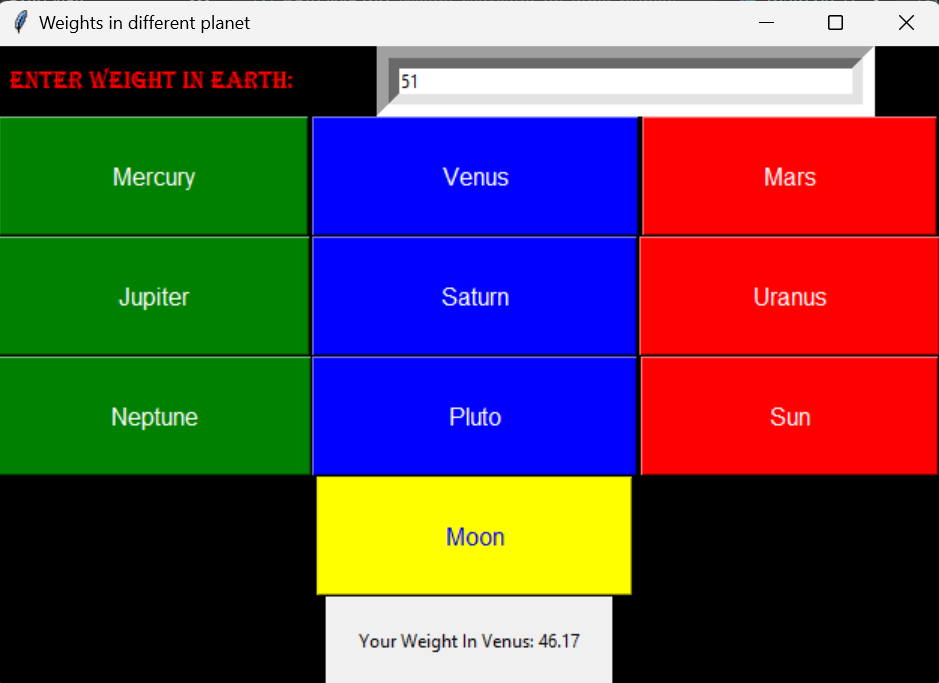

# Weight Calculator for Different Planets

This is a simple Python mini-project created using Tkinter to calculate weight on different planets in our solar system. 

## Overview

This application allows users to input their weight on Earth and then calculates their weight on various planets. It provides the functionality to calculate weight on Mercury, Venus, Mars, Jupiter, Saturn, Uranus, Neptune, Pluto, Sun, and Moon.

## Features

- **User-friendly Interface**: The graphical user interface (GUI) is created using Tkinter, making it easy for users to interact with the application.
- **Planet Selection**: Users can choose different planets to calculate their weight, with each planet's gravity taken into account.
- **Real-time Calculation**: The weight on each planet is calculated instantly as the user selects a planet.
- **Stylish Design**: The application features colorful buttons and labels to enhance the visual experience.

## Usage

1. Enter your weight in the provided input field.
2. Click on the corresponding planet button to see your weight on that planet.
3. The calculated weight will be displayed below the input field.

## Output Screenshot

## Dependencies

- Python 3 and above
- Tkinter (Python GUI library)

